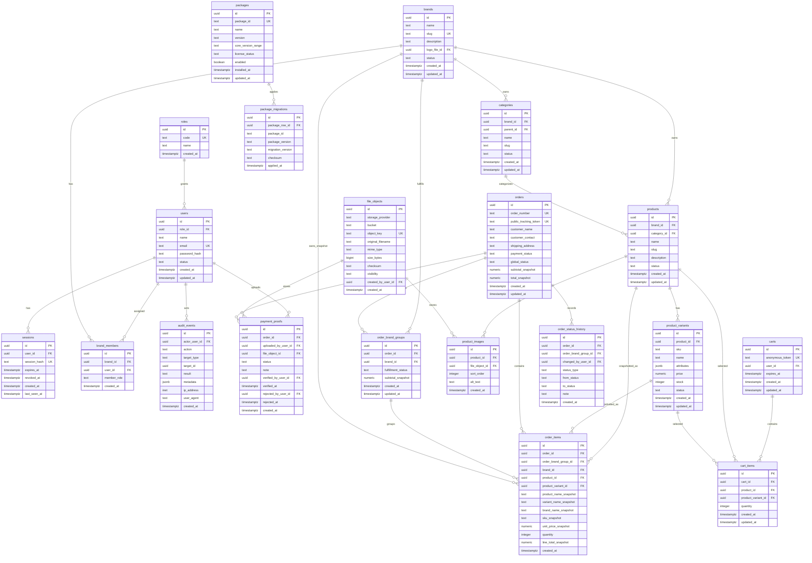
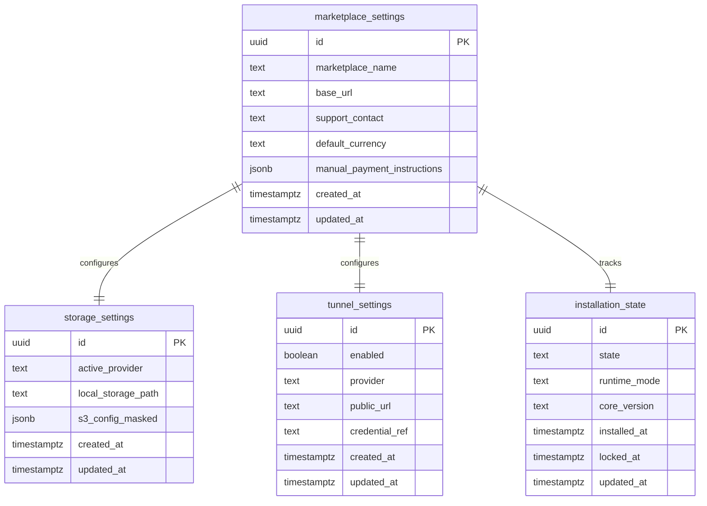

# ERD — Self-Hosted Multi-Brand Marketplace

Dokumen ini mendefinisikan rancangan awal Entity Relationship Diagram untuk marketplace self-hosted multi-brand. ERD ini menjadi turunan dari `PRD.md` dan `TRD.md`.

Status: rancangan awal untuk MVP. Nama kolom final dapat berubah saat implementasi migration SQL.

## 1. Prinsip Data Model

- Satu instalasi = satu marketplace.
- Satu marketplace dapat memiliki banyak brand.
- Seller dibuat oleh Super Admin, bukan self-registration.
- Satu seller dapat mengelola banyak brand melalui `brand_members`.
- Produk berada di bawah brand.
- Produk dapat memiliki category dan variant.
- Satu order dapat berisi produk lintas brand.
- Order lintas brand dipecah menjadi `order_brand_groups` untuk status fulfillment per brand.
- Bukti transfer disimpan sebagai file private dan metadata-nya disimpan di database.
- Package/module berbayar dikelola lewat registry `packages` dan migration state `package_migrations`.

## 2. Diagram ERD Utama

## 3. Diagram Settings & Installation

## 4. Relasi Utama

### 4.1 User, Role, dan Seller Assignment

| Relasi | Kardinalitas | Catatan |
| --- | --- | --- |
| `roles` → `users` | 1:N | Role minimum: `super_admin`, `seller`. |
| `users` → `brand_members` | 1:N | Satu seller bisa punya banyak assignment brand. |
| `brands` → `brand_members` | 1:N | Satu brand dapat dikelola banyak seller jika diperlukan. |

Constraint penting:

- `users.email` unique.
- `roles.code` unique.
- `brand_members(user_id, brand_id)` unique.
- Seller tidak bisa mengakses brand tanpa record `brand_members`.

### 4.2 Brand, Category, Product, Variant

| Relasi | Kardinalitas | Catatan |
| --- | --- | --- |
| `brands` → `categories` | 1:N | Category scoped per brand. |
| `categories` → `categories` | 1:N | Optional parent-child category. |
| `brands` → `products` | 1:N | Product selalu punya brand owner. |
| `categories` → `products` | 1:N | Product bisa berada dalam category. |
| `products` → `product_variants` | 1:N | Variant menyimpan SKU, price, stock. |
| `products` → `product_images` | 1:N | Product image mengarah ke `file_objects`. |

Constraint penting:

- `brands.slug` unique global karena 1 domain = 1 marketplace.
- `categories(brand_id, slug)` unique.
- `products(brand_id, slug)` unique.
- `product_variants(product_id, sku)` unique jika SKU disediakan.
- `product_variants.stock >= 0`.
- `product_variants.price >= 0`.

### 4.3 Cart dan Checkout

| Relasi | Kardinalitas | Catatan |
| --- | --- | --- |
| `carts` → `cart_items` | 1:N | Guest cart memakai anonymous token. |
| `products` → `cart_items` | 1:N | Item mengarah ke produk aktif. |
| `product_variants` → `cart_items` | 1:N | Variant wajib untuk item yang memiliki variant. |

Constraint penting:

- Cart kosong tidak bisa checkout.
- Quantity harus lebih dari 0.
- Quantity tidak boleh melebihi stock variant saat checkout.

### 4.4 Order Lintas Brand

| Relasi | Kardinalitas | Catatan |
| --- | --- | --- |
| `orders` → `order_brand_groups` | 1:N | Satu group per brand dalam order. |
| `brands` → `order_brand_groups` | 1:N | Fulfillment status per brand. |
| `orders` → `order_items` | 1:N | Snapshot semua item order. |
| `order_brand_groups` → `order_items` | 1:N | Seller melihat item dari group brand miliknya. |
| `orders` → `order_status_history` | 1:N | Audit perubahan status. |

Constraint penting:

- `orders.order_number` unique.
- `orders.public_tracking_token` unique dan random, bukan sequential ID.
- `order_brand_groups(order_id, brand_id)` unique.
- `order_items` menyimpan snapshot nama, brand, SKU, harga, dan quantity.

Status utama:

- `orders.payment_status`: `pending`, `waiting_payment_verification`, `confirmed`, `rejected`, `cancelled`.
- `orders.global_status`: `open`, `confirmed`, `in_progress`, `partially_shipped`, `completed`, `cancelled`.
- `order_brand_groups.fulfillment_status`: `not_ready`, `ready_to_process`, `processing`, `shipped`, `completed`, `cancelled`.

### 4.5 Payment Proof

| Relasi | Kardinalitas | Catatan |
| --- | --- | --- |
| `orders` → `payment_proofs` | 1:N | Schema mendukung banyak bukti transfer per order. |
| `file_objects` → `payment_proofs` | 1:N | File proof private, tidak public. |
| `users` → `payment_proofs` | 1:N | Nullable untuk guest upload. |

Constraint penting:

- Payment proof tidak otomatis mengubah order menjadi confirmed.
- Verifikasi/reject harus dilakukan admin dan tercatat di audit log.
- Payment proof harus disajikan via protected route.

### 4.6 File Objects

| Relasi | Kardinalitas | Catatan |
| --- | --- | --- |
| `file_objects` → `product_images` | 1:N | Product image public jika produk published. |
| `file_objects` → `payment_proofs` | 1:N | Payment proof private. |

Visibility:

- `public`
- `authenticated`
- `private_admin`

Constraint penting:

- `file_objects.object_key` unique.
- File path tidak memakai filename asli user.
- MIME, extension, magic bytes, ukuran, dan dimensi harus divalidasi.

### 4.7 Package Registry

| Relasi | Kardinalitas | Catatan |
| --- | --- | --- |
| `packages` → `package_migrations` | 1:N | Migration package dilacak terpisah dari core migration. |

Constraint penting:

- `packages.package_id` unique.
- Package memiliki compatibility range terhadap core.
- Package disabled tidak boleh merusak base flow.

## 5. Rekomendasi Index

| Table | Index |
| --- | --- |
| `users` | unique `email` |
| `roles` | unique `code` |
| `sessions` | unique `session_hash`, index `user_id`, index `expires_at` |
| `brands` | unique `slug`, index `status` |
| `brand_members` | unique `(user_id, brand_id)`, index `brand_id` |
| `categories` | unique `(brand_id, slug)`, index `parent_id` |
| `products` | unique `(brand_id, slug)`, index `(brand_id, status)`, index `category_id` |
| `product_variants` | unique `(product_id, sku)`, index `product_id`, index `status` |
| `product_images` | index `product_id`, index `file_object_id` |
| `file_objects` | unique `object_key`, index `visibility`, index `created_by_user_id` |
| `carts` | unique `anonymous_token`, index `user_id`, index `expires_at` |
| `cart_items` | unique `(cart_id, product_variant_id)`, index `product_id` |
| `orders` | unique `order_number`, unique `public_tracking_token`, index `payment_status`, index `global_status`, index `created_at` |
| `order_brand_groups` | unique `(order_id, brand_id)`, index `(brand_id, fulfillment_status)` |
| `order_items` | index `order_id`, index `order_brand_group_id`, index `brand_id` |
| `payment_proofs` | index `order_id`, index `file_object_id`, index `status` |
| `packages` | unique `package_id`, index `enabled` |
| `package_migrations` | unique `(package_id, migration_version)` |
| `audit_events` | index `actor_user_id`, index `(target_type, target_id)`, index `created_at` |

## 6. Delete & Retention Policy Awal

MVP sebaiknya menghindari hard delete untuk data operasional penting.

Rekomendasi:

- `brands`: soft delete/status inactive.
- `products`: soft delete/status archived.
- `orders`: tidak dihapus dari UI normal.
- `order_items`: immutable setelah order dibuat.
- `payment_proofs`: tidak dihapus setelah diverifikasi kecuali ada kebijakan retensi eksplisit.
- `audit_events`: append-only.
- `sessions`: boleh dihapus/expired secara berkala.
- `carts`: expired cart boleh dibersihkan berkala.

## 7. Open Questions

- Bagaimana constraint/index untuk menandai satu payment proof aktif per order di UI MVP tanpa menghapus histori multi-proof?
- Detail matrix RBAC payment proof: Super Admin dapat melihat semua proof; seller default hanya melihat status pembayaran/order brand assigned sampai permission eksplisit untuk file proof ditambahkan.
- Apakah category wajib scoped per brand atau ada global marketplace category pada fase lanjut?
- Apakah product price disimpan hanya di variant, atau product juga punya default price jika tanpa variant?
